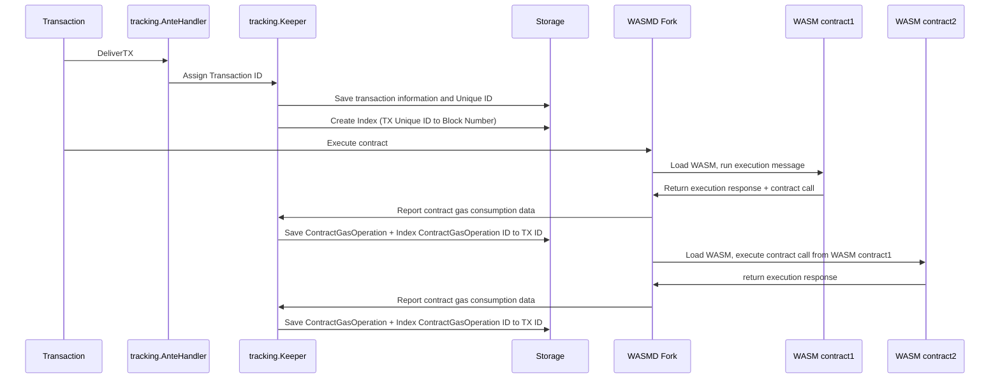

# ADR-001 Tracking Module

## Status

Already implemented.

## Abstract

We propose a new module called `x/tracking` that leverages our fork of [x/wasm](https://github.com/archway-network/archway-wasmd),
which has contract gas logging capabilities.

The module records contract gas usage on state, associating gas usage to the block and the tx in which the computational
effort happened.

## Context

Archway requires an economically efficient way to track contract gas usage, in order to  create an environment in which
contracts are rewarded fairly, deep inspection on what happens during `wasm` execution is required. Interactions between
contracts need to be recorded and during each interaction we store the gas usage of a contract.

Archway uses gas as a way to reward contracts; In fact, it is the measure of contracts bringing volume to the network,
and the protocol rewards accordingly.

## Architecture

When a transaction goes through the `DeliverTX` process and reaches the `tracking.AnteHandler` stage, it gets assigned an ID,
which is a steadily increasing number. This ID connects the transaction to the gas used by a `WASM` contract, and a `uint64`
type is used because it takes up less space than a `tx_hash`. We also create an index that links this unique transaction ID
to the block number.

The `tracking.Keeper` is designed to work with our `x/wasmd` fork, and it implements the `ContractGasProcessor` interface.
When a transaction involves a `WASM contract`, a new `ContractGasOperation` is generated with its own unique, steadily increasing ID.
This operation records the type of operation, the gas used by the virtual machine (VM), and the gas used when accessing the store.
If the `WASM contract` interacts with another contract, whether by querying or executing, an additional ContractGasOperation is created. 
We also establish an index linking the contract gas operation ID to the transaction ID.

This setup allows us to accurately determine the influence of each contract on a transaction, taking into account the gas volume.

Once all transactions have been processed, the EndBlock phase occurs. During this stage, we record the total gas used by contracts within the block.

Transaction  tracking flow: 

### Technical Specification

For the full spec refer to the [spec folder](../../x/tracking/spec).

### Important notes

`x/tracking` does not prune data, `x/rewards` collects it and prunes it every block.

### Glossary

[1] operation: any contract operation scoped to the `WASM` method being called (`Execute`, `Query`, ...)
