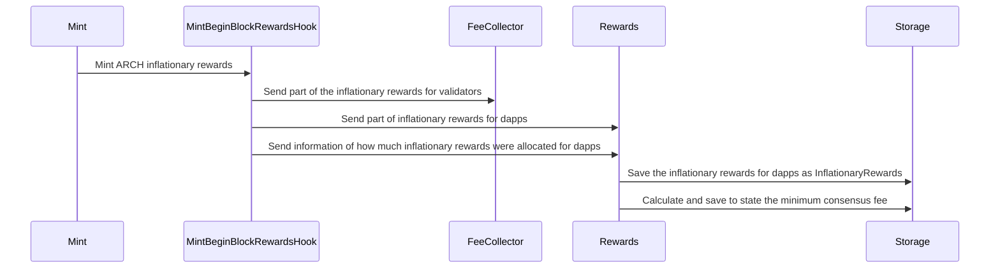
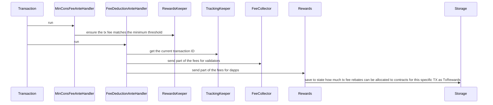
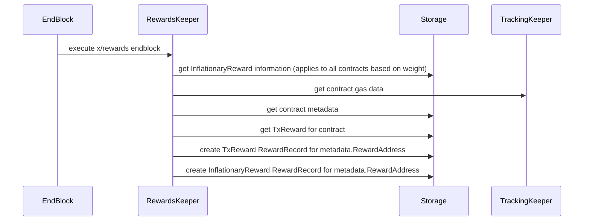

# ADR-002 rewards module

## Status

Already implemented.

## Abstract

We propose a new module called `x/rewards`, this module consumes information gathered by `x/tracking` to create `RewardsRecords`.
The `RewardsRecords` define claims that contract can convert into `archway coins`, the claims are associated with gas consumption
that a contract has caused in a specific TX in a specific block, this `RewardRecord` can come from either inflationary rewards
or from a portion of the TX fees.

## Context

The `x/rewards` module makes use of the `x/tracking` module to reward contracts in a fair way.
The rewards are divided in two different forms:
- Tx Fee Rebates: a proportion of the transaction fees (defined by governance)
- Inflationary Rewards: a proportion of Proof of Stake inflationary rewards (defined by governance)

## Architecture

## Participating in `x/rewards`

In order to participate in `x/rewards`, the admin of the contract needs to register the contract to the `x/rewards` module
it does so by sending a `SetContractMetadata` message in a transaction, the admin of the contract also sets a `WithdrawAddress`, which
will be the address able to claim the contract's rewards.

### Hook on x/mint `BeginBlock`

We have a hook on `x/mint`, which will be removed when we launch our own `x/mint`, that when coins are being sent to 
`fee_collector` (which escrows staking rewards + tx fees), a portion is redirected to `x/rewards`, when this happens
we also set the new minimum consensus fee (inflation is required to compute the minimum consensus fee), `x/rewards` also
records how many inflationary rewards were allocated for dapps.

Sequence diagram:

### `x/rewards` messages

### During TX execution of an `x/wasm` message

The execution flow of `x/rewards` starts at the `AnteHandler`, `x/rewards` has two ante handlers, the first one is the 
`MinimumConsensusFee` which ensures that transactions have a minimum fee. More info on how the minimum consensus fee is 
calculated can be found [here](ADR-003-minimum-consensus-fee.md).

After we ensure that the minimum consensus fee is reached, the second `x/rewards` `AnteHandler` runs (NOTE: it runs after
the `x/tracking` `AnteHandler`), it uses the unique transaction ID of `x/tracking`. It extends the canonical cosmos-sdk's
`FeeDeduction` `AnteHandler` by splitting the fees of  the transaction between the `fee_collector` and `x/rewards`. The 
`AnteHandler` creates a state object called `TxRewards` which keeps track of the maximum amount of coins to be distributed
to contracts for this specific TX.

### EndBlock

During `EndBlock` information from `x/tracking` is collected, and turned into `RewardRecords`, we do the following:

We iterate over all `x/tracking` `ContractGasOperation`s, we fetch from `x/rewards` how much fees we should distribute 
associated with the TX and the inflationary rewards. 

Based on the weight (measured as `gas_in_contract`/`total_tx_gas`) a contract had in a transaction we take part of the 
rewards saved in `TxRewards` and turn them into `RewardRecord` 

Based on the weight (measured as `total_gas_of_contract_in_block`/`total_block_gas`) a contract had in the block we take
part of the rewards saved in `InflationaryRewards` and turn them into `RewardRecord`.

Not all rewards will be allocated, the unallocated rewards are sent to a `TreasuryPool` which will be using the funds in
the future.

Sequence diagram:

### Claiming Rewards

`RewardRecords` are saved based on the `metadata.RewardAddress`, this is useful because in case the owner of a contract
rotates the old owner can still withdraw  the accrued rewards before the ownership transferral.

In order to claim rewards, a message `WithdrawRewards` needs to be sent, a response is returned containing rewards data 
like the time at which the rewards were accrued, the reason for which rewards need to be explicitly withdrawn is to allow
contracts which re-distribute rewards to always be able to lazily compute the history of inputs (balance changes with respect
to accrued rewards).

### Spec

For the full spec refer to the [spec folder](../../x/rewards/spec).
