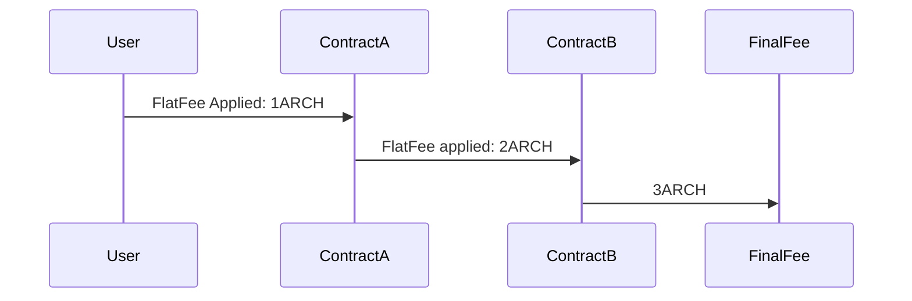
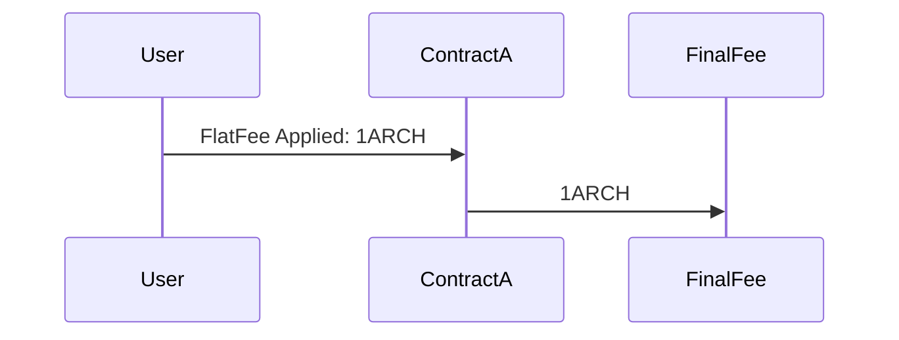

# ADR 004 - Contract Premiums

## Status

Already implemented.

## Abstract

Contract premiums allow smart contract developers to define a custom flat fee for interacting with their smart contract.

## Context

Contract developers can use contract premiums to define a custom fee, that is applied after computational fees.

Contract premiums can be used to cover hidden costs of a smart contract, for example a NFT marketplace which delivers goods
can use contract premiums to cover delivery costs.

The reasons for using contract premiums over using [`x/wasm funds`](https://book.cosmwasm.com/basics/funds.html) are:
1. Fee predictability: Contract Premiums define a standardized way to define contract custom fees and can be used by wallets to predict fees
2. Rewards on Msg Fail: When using Contract Premiums rewards will be distributed even when the contract msg execution fails. Using the x/wasm funds way would not reward the developer if the msg execution failed due to bad input by the user.
3. Rewards withdrawal: Contract Premiums sends all the rewards to the configured rewards address. Using the x/wasm funds option would send all the funds to the smart contract unless custom transfer logic is implemented.
4. Easier regulatory compliance: Using contract premiums, developer receives the rewards only when they explicitly request to withdraw (similar to how staking rewards works). Using x/wasm funds to receive the funds, which happens immediately, might complicate the tax situation based on the jurisdiction. 
5. One configuration to rule them all: Once set, Contract Premiums are applied to all Msg Executions exposed by the contract, as opposed having to be configured for every msg.

### Proposal

We add a new `sdk.Msg` to `x/rewards` called `MsgSetFlatFee` which allows the contract `metadata` owner to define a custom
flat fee.

We then extend our `FeeDeduction` `AnteHandler` to fetch the `FlatFee` of a contract, if the `FlatFee` exists then the 
`AnteHandler` ensures the `tx.Fees` are enough to also cover the `FlatFee`, making tx costs explicit for the end-user too.
`FlatFees` are then sent directly to the contract's `metadata.RewardAddress`.

### Limitations

#### Application of Contract Premiums

The contract premium is only applied for the initial contract call, provided that the `FlatFee` is set. The protocol does not automatically apply contract premiums for any subsequent calls to other contracts. The reasons for this design are both technical and architectural, namely:

1. Conditional Contract Calls (Technical Reason) - Contracts may be desinged to call other contracts based on complex conditional logic following intricate business process flows. This logic can only be followed to conclusion on transaction execution and it would thus not be possible for the protocol to predict transaction fees.

Consider the following example: `ContractA` contains a conditional statement that calls `ContractB`, only if the condition evaluates to true.

The condition evaluates to `true`:

The condition evaluates to `false`:

2. Contract Composability (Architectural Reason) - Contracts are often developed together as part of contract complexes. Automatically enforcing contract premiums will limit contract composability and utility.

Consider the following example: A developer produces a contract complex with three disctinct contracts. `ContractA` serves as the entry point for this complex, which in turn will call `ContractB` and `ContractC`. The developer elects to only set a premium on `ContractA`. However, `ContractC` provides a valuable utility and other developers adopt it for their purposes. The original developer can now set the `FlatFee` and add logic to only enforce the premium when `ContractC` is called by anything other than `ContractA` or `ContractB`.

**Conclusion**

At first glance it would seem that this limitation would be restrictive, however the protocol defines efficient wasm bindings for quering contract premiums that allows for great flexibility in both implementation and architecture of contracts.

Developers can add logic to check if the contract caller is a regular account or another contract. In the case of another contract the contract premium can be internally applied. The fee state can be queried to ensure sufficient fees are available to cover the premium or execution can return with an _"insufficient premium fee"_ or similar error response.

This form of composability would be severely limited from an architectural perspective if premiums were to be applied automatically. With our approach developers maintain the flexibility of deciding when and how to apply premiums.

#### Reverts cause the FlatFee to be lost

On contract call failures the TX is reverted and the flat fee would be lost too. This is a limitation of the `cosmos-sdk`
that does not allow us to give the user the `FlatFee` back in case of TX failure as the SDK does not implement post tx execution handlers.

### User Experience – A note on wallet and frontend integration

Contract premiums and minimum consensus fees only affect transactions that involve WASM contract execution. They don't 
change other processes like staking, governance, transfers, and so on.

Still, fees for contract interactions need to be changed, and we'll explain how to do that below.

First, wallets don't need to be changed to work with Archway Network's special fees, since normal operations aren't affected by this fee management system. So, only contract interactions need to be handled.

A contract always has a user interface (UI). UIs usually work as a go-between for a wallet (like Keplr) and the contract.
The front-end, or what users see and interact with, is the part that needs to be changed to handle contract premiums correctly. This is fair because the contract developer, who sets the contract premium, is also the one who created the contract.

#### Correct fee setting flow

Once the UI knows which is the message that needs to be sent to the contract, it needs to set the fees for the TX,
in order to correctly set fees it needs to:
1. Simulate the TX, using the standard Simulate TX endpoint of `cosmos-sdk`, this returns the estimated `gas_limit` for the TX.
2. Send a query to the archway [EstimateTxFees](../../proto/archway/rewards/v1/query.proto?L32) 
gRPC query method, and feed it the `gas_limit` returned in step `1.` and the contract being interacted with. 
3. Set the fee in the wallet TX.

### Note on FlatFee limits

An upper-limit is not imposed on the FlatFee.

This may raise the concern that an unscrupulous developer may set an excessive high fee once the contract achieves high adoption. __However,__ both users and calling contracts can easily deal with this by simply rejecting such transactions. The protocol defines efficient wasm bindings for querying flat fees and these can be used to impose upper limits to the flat fee set by external contracts.
